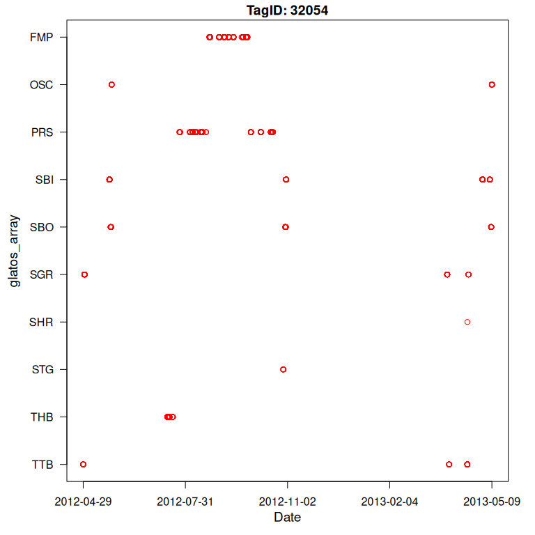

# glatos

### Overview

**glatos** is an R package with functions useful to members of the Great
Lakes Acoustic Telemetry Observation System <https://glatos.org>.
Functions may be generally useful for processing, analyzing, simulating,
and visualizing acoustic telemetry data, but are not strictly limited to
acoustic telemetry applications. **glatos** is hosted by the Ocean
Tracking Network on
[github](https://github.com/ocean-tracking-network/glatos).

### Getting started

If you are just getting started with **glatos**, we recommend checking
out the vignettes and package examples (see below). Other resources can
be found on the glatos webpage (<https://glatos.org>).

### Contributing

- We are always looking for new contributors or new ideas! See
  [CONTRIBUTING.md](https://github.com/ocean-tracking-network/glatos/blob/main/CONTRIBUTING.md)

- To report a bug, ask a question, or propose something new, submit an
  [Issue](https://github.com/ocean-tracking-network/glatos/issues) or
  email the maintainer (Chris Holbrook): <cholbrook@glfc.org>.

### Installation

- To install the latest release (0.9.8 ‘pretty-fragrant-rye’):

``` r

if (!require("pak")) {
  install.packages("pak")
}
pak::pak("ocean-tracking-network/glatos")
```

- To install the development version, an earlier version, or to see
  frequently asked questions about installation, see
  [install](https://github.com/ocean-tracking-network/glatos/wiki/installation-instructions)

### Additional resources

- R resources
  [R](https://github.com/ocean-tracking-network/glatos/wiki/resources)
- GLATOS R workshops/manuals
  [GLATOS](https://github.com/ocean-tracking-network/glatos/wiki/Past-R-workshops-and-manuals)

### Examples

### Data loading and processing

#### Read glatos detection export file

``` r

library(glatos)

# load example file
det_file <- system.file("extdata", "walleye_detections.csv", package = "glatos")

# read glatos detections
head(read_glatos_detections(det_file))
```

``` R
  animal_id detection_timestamp_utc glatos_array station_no
1       153     2012-04-29 01:48:37          TTB          2
2       153     2012-04-29 01:52:55          TTB          2
3       153     2012-04-29 01:55:12          TTB          2
4       153     2012-04-29 01:56:42          TTB          2
5       153     2012-04-29 01:58:37          TTB          2
6       153     2012-04-29 02:01:22          TTB          2
  transmitter_codespace transmitter_id sensor_value sensor_unit deploy_lat
1              A69-9001          32054           NA        <NA>   43.39165
2              A69-9001          32054           NA        <NA>   43.39165
3              A69-9001          32054           NA        <NA>   43.39165
4              A69-9001          32054           NA        <NA>   43.39165
5              A69-9001          32054           NA        <NA>   43.39165
6              A69-9001          32054           NA        <NA>   43.39165
  deploy_long receiver_sn tag_type tag_model tag_serial_number common_name_e
1   -83.99264      113213     <NA>      <NA>              <NA>       walleye
2   -83.99264      113213     <NA>      <NA>              <NA>       walleye
3   -83.99264      113213     <NA>      <NA>              <NA>       walleye
4   -83.99264      113213     <NA>      <NA>              <NA>       walleye
5   -83.99264      113213     <NA>      <NA>              <NA>       walleye
6   -83.99264      113213     <NA>      <NA>              <NA>       walleye
     capture_location length weight sex release_group release_location
1 Tittabawassee River  0.565     NA   F          <NA>    Tittabawassee
2 Tittabawassee River  0.565     NA   F          <NA>    Tittabawassee
3 Tittabawassee River  0.565     NA   F          <NA>    Tittabawassee
4 Tittabawassee River  0.565     NA   F          <NA>    Tittabawassee
5 Tittabawassee River  0.565     NA   F          <NA>    Tittabawassee
6 Tittabawassee River  0.565     NA   F          <NA>    Tittabawassee
  release_latitude release_longitude utc_release_date_time
1               NA                NA   2012-03-20 20:00:00
2               NA                NA   2012-03-20 20:00:00
3               NA                NA   2012-03-20 20:00:00
4               NA                NA   2012-03-20 20:00:00
5               NA                NA   2012-03-20 20:00:00
6               NA                NA   2012-03-20 20:00:00
  glatos_project_transmitter glatos_project_receiver glatos_tag_recovered
1                      HECWL                   HECWL                   NO
2                      HECWL                   HECWL                   NO
3                      HECWL                   HECWL                   NO
4                      HECWL                   HECWL                   NO
5                      HECWL                   HECWL                   NO
6                      HECWL                   HECWL                   NO
  glatos_caught_date station min_lag
1               <NA> TTB-002     258
2               <NA> TTB-002     137
3               <NA> TTB-002      90
4               <NA> TTB-002      90
5               <NA> TTB-002     115
6               <NA> TTB-002     145
```

#### Read basin-wide receiver location file

``` r

# extract path to example file in glatos package
rec_file <- system.file("extdata", "sample_receivers.csv", package = "glatos")

# read file and display first 5 rows
head(read_glatos_receivers(rec_file))
```

``` R
  station glatos_array station_no consecutive_deploy_no intend_lat intend_long
1 WHT-009          WHT          9                     1         NA          NA
2 FDT-001          FDT          1                     2         NA          NA
3 FDT-004          FDT          4                     2         NA          NA
4 FDT-003          FDT          3                     2         NA          NA
5 FDT-002          FDT          2                     2         NA          NA
6 DTR-001          DTR          1                     2         NA          NA
  deploy_lat deploy_long recover_lat recover_long    deploy_date_time
1   43.74216   -82.50791          NA           NA 2010-09-22 18:05:00
2   45.93014   -83.50204          NA           NA 2010-11-12 15:07:00
3   45.94764   -83.48847          NA           NA 2010-11-12 15:36:00
4   45.93794   -83.46884          NA           NA 2010-11-12 15:56:00
5   45.92377   -83.48483          NA           NA 2010-11-12 16:26:00
6   45.97745   -83.89740          NA           NA 2010-11-12 19:43:00
    recover_date_time bottom_depth riser_length instrument_depth ins_model_no
1 2012-08-15 16:52:00           NA           NA               NA         VR2W
2 2012-05-15 13:25:00           NA           NA               NA          VR3
3 2012-05-15 14:15:00           NA           NA               NA          VR3
4 2012-05-15 14:40:00           NA           NA               NA          VR3
5 2012-05-15 16:10:00           NA           NA               NA          VR3
6 2012-05-10 15:49:00           NA           NA               NA          VR3
  glatos_ins_frequency ins_serial_no deployed_by comments glatos_seasonal
1                   69        109450                                   NO
2                   69           442                                   No
3                   69           441                                   No
4                   69           444                                   No
5                   69           447                                   No
6                   69           439                                   No
  glatos_project glatos_vps
1          HECWL         NO
2          DRMLT         No
3          DRMLT         No
4          DRMLT         No
5          DRMLT         No
6          DRMLT         No
```

#### Read glatos submission workbook

``` r

# get packaged example workbook
wb2_file <- system.file("extdata", "walleye_workbook.xlsx", package = "glatos")

# read file
# output is a list of three tables- metadata, animals, receivers
wb2 <- read_glatos_workbook(wb2_file)

# Metadata table
head(wb2$metadata)
```

``` R
$project_code
[1] "HECWL"

$principle_investigator
[1] "PI"

$pi_email
[1] "thayden@usgs.gov"

$source_file
[1] "walleye_workbook.xlsx"

$wb_version
[1] "1.4"

$created
[1] "2026-07-23 15:31:36 EDT"
```

``` r

# Animals table
head(wb2$animals)
```

``` R
  animal_id tag_type tag_manufacturer tag_model tag_serial_number tag_id_code
1       120     <NA>            VEMCO    V16-4x           1106553       32024
2       107     <NA>            VEMCO    V16-4x           1106541       32012
3       109     <NA>            VEMCO    V16-4x           1106543       32014
4       115     <NA>            VEMCO    V16-4x           1106549       32020
5       124     <NA>            VEMCO    V16-4x           1106557       32028
6        68     <NA>            VEMCO    V16-4x           1106507       31978
  tag_code_space tag_implant_type tag_activation_date est_tag_life tagger
1       A69-9001         internal                <NA>         1338   <NA>
2       A69-9001         internal                <NA>         1338   <NA>
3       A69-9001         internal                <NA>         1338   <NA>
4       A69-9001         internal                <NA>         1338   <NA>
5       A69-9001         internal                <NA>         1338   <NA>
6       A69-9001         internal                <NA>         1338   <NA>
  tag_owner_pi tag_owner_organization common_name_e scientific_name
1         <NA>                   <NA>       walleye  Sander vitreus
2         <NA>                   <NA>       walleye  Sander vitreus
3         <NA>                   <NA>       walleye  Sander vitreus
4         <NA>                   <NA>       walleye  Sander vitreus
5         <NA>                   <NA>       walleye  Sander vitreus
6         <NA>                   <NA>       walleye  Sander vitreus
  capture_location capture_latitude capture_longitude wild_or_hatchery stock
1     Maumee River         41.56093           -83.645             <NA>  <NA>
2     Maumee River         41.56093           -83.645             <NA>  <NA>
3     Maumee River         41.56093           -83.645             <NA>  <NA>
4     Maumee River         41.56093           -83.645             <NA>  <NA>
5     Maumee River         41.56093           -83.645             <NA>  <NA>
6     Maumee River         41.56093           -83.645             <NA>  <NA>
  length weight length_type age sex dna_sample_taken treatment_type
1  0.627     NA       total   7   F             <NA>           <NA>
2  0.706     NA       total   8   F             <NA>           <NA>
3  0.615     NA       total  12   M             <NA>           <NA>
4  0.465     NA       total   6   M             <NA>           <NA>
5  0.466     NA       total   4   M             <NA>           <NA>
6  0.460     NA       total   4   M             <NA>           <NA>
  release_group release_location release_latitude release_longitude
1          <NA>           Maumee         41.56093           -83.645
2          <NA>           Maumee         41.56093           -83.645
3          <NA>           Maumee         41.56093           -83.645
4          <NA>           Maumee         41.56093           -83.645
5          <NA>           Maumee         41.56093           -83.645
6          <NA>           Maumee         41.56093           -83.645
  utc_release_date_time capture_depth temperature_change holding_temperature
1   2011-03-28 04:00:00            NA                 NA                  NA
2   2011-03-28 04:01:00            NA                 NA                  NA
3   2011-03-28 04:05:00            NA                 NA                  NA
4   2011-03-28 04:13:00            NA                 NA                  NA
5   2011-03-28 04:27:00            NA                 NA                  NA
6   2011-03-28 04:28:00            NA                 NA                  NA
  surgery_location date_of_surgery surgery_latitude surgery_longitude sedative
1           Maumee            <NA>         43.59881         -84.23942     <NA>
2           Maumee            <NA>         43.59881         -84.23942     <NA>
3           Maumee            <NA>         43.59881         -84.23942     <NA>
4           Maumee            <NA>         43.59881         -84.23942     <NA>
5           Maumee            <NA>         43.59881         -84.23942     <NA>
6           Maumee            <NA>         43.59881         -84.23942     <NA>
  sedative_concentration anaesthetic buffer anaesthetic_concentration
1                   <NA>        <NA>   <NA>                      <NA>
2                   <NA>        <NA>   <NA>                      <NA>
3                   <NA>        <NA>   <NA>                      <NA>
4                   <NA>        <NA>   <NA>                      <NA>
5                   <NA>        <NA>   <NA>                      <NA>
6                   <NA>        <NA>   <NA>                      <NA>
  buffer_concentration_in_anaesthetic anesthetic_concentration_in_recirculation
1                                <NA>                                      <NA>
2                                <NA>                                      <NA>
3                                <NA>                                      <NA>
4                                <NA>                                      <NA>
5                                <NA>                                      <NA>
6                                <NA>                                      <NA>
  buffer_concentration_in_recirculation dissolved_oxygen comments
1                                  <NA>             <NA>     <NA>
2                                  <NA>             <NA>     <NA>
3                                  <NA>             <NA>     <NA>
4                                  <NA>             <NA>     <NA>
5                                  <NA>             <NA>     <NA>
6                                  <NA>             <NA>     <NA>
  glatos_project glatos_external_tag_id1 glatos_external_tag_id2
1          HECWL                    5017                    5016
2          HECWL                    5074                    5075
3          HECWL                    5057                    5058
4          HECWL                    5060                    5061
5          HECWL                    5091                    5092
6          HECWL                    5082                    5083
  glatos_tag_recovered glatos_caught_date glatos_reward
1                   NO               <NA>          <NA>
2                  YES         2013-04-19          <NA>
3                   NO               <NA>          <NA>
4                   NO               <NA>          <NA>
5                   NO               <NA>          <NA>
6                   NO               <NA>          <NA>
```

``` r

# receivers table
head(wb2$receivers)
```

``` R
  glatos_array glatos_project station_no consecutive_deploy_no ins_serial_no
1          BBI          HECWL          5                     1        109493
2          BBI          HECWL          4                     1        109985
3          BBI          HECWL          3                     1        109908
4          BBI          HECWL          2                     1        109492
5          FMP          HECWL          3                     1        109499
6          FMP          HECWL          2                     1        109509
  otn_array mooring_drop_dead_date intend_lat intend_long otn_mission_id
1      <NA>                   <NA>       <NA>        <NA>           <NA>
2      <NA>                   <NA>       <NA>        <NA>           <NA>
3      <NA>                   <NA>       <NA>        <NA>           <NA>
4      <NA>                   <NA>       <NA>        <NA>           <NA>
5      <NA>                   <NA>       <NA>        <NA>           <NA>
6      <NA>                   <NA>       <NA>        <NA>           <NA>
     deploy_date_time deploy_lat deploy_long bottom_depth riser_length
1 2010-09-14 15:58:00   45.70701   -84.41849           NA           NA
2 2010-09-14 16:11:00   45.69908   -84.41951           NA           NA
3 2010-09-14 16:20:00   45.69116   -84.41951           NA           NA
4 2010-09-14 16:33:00   45.68316   -84.41941           NA           NA
5 2010-09-15 15:30:00   45.50758   -83.90125           NA           NA
6 2010-09-15 15:39:00   45.49911   -83.90592           NA           NA
  instrument_depth checwlk_complete_time status_in ins_model_no
1               NA                  <NA>      <NA>         VR2W
2               NA                  <NA>      <NA>         VR2W
3               NA                  <NA>      <NA>         VR2W
4               NA                  <NA>      <NA>         VR2W
5               NA                  <NA>      <NA>         VR2W
6               NA                  <NA>      <NA>         VR2W
  glatos_ins_frequency rcv_modem_address sync_date_time memory_erased_at_deploy
1                   69              <NA>           <NA>                    <NA>
2                   69              <NA>           <NA>                    <NA>
3                   69              <NA>           <NA>                    <NA>
4                   69              <NA>           <NA>                    <NA>
5                   69              <NA>           <NA>                    <NA>
6                   69              <NA>           <NA>                    <NA>
  rcv_battery_install_date rcv_expected_battery_life rcv_voltage_at_deploy
1                     <NA>                      <NA>                  <NA>
2                     <NA>                      <NA>                  <NA>
3                     <NA>                      <NA>                  <NA>
4                     <NA>                      <NA>                  <NA>
5                     <NA>                      <NA>                  <NA>
6                     <NA>                      <NA>                  <NA>
  rcv_tilt_after_deploy deployed_by comments glatos_seasonal glatos_vps
1                  <NA>        <NA>     <NA>              NO         NO
2                  <NA>        <NA>     <NA>              NO         NO
3                  <NA>        <NA>     <NA>              NO         NO
4                  <NA>        <NA>     <NA>              NO         NO
5                  <NA>        <NA>     <NA>              NO         NO
6                  <NA>        <NA>     <NA>              NO         NO
  ar_confirm data_downloaded ins_model_number recovered   recover_date_time
1       <NA>            <NA>             <NA>      <NA> 2011-09-16 18:50:00
2       <NA>            <NA>             <NA>      <NA> 2011-09-16 17:00:00
3       <NA>            <NA>             <NA>      <NA> 2011-09-16 18:10:00
4       <NA>            <NA>             <NA>      <NA> 2011-09-16 19:20:00
5       <NA>            <NA>             <NA>      <NA> 2011-07-07 18:10:00
6       <NA>            <NA>             <NA>      <NA> 2011-07-07 17:10:00
  recover_lat recover_long          location_description water_body
1          NA           NA Bois Blanc Island (East line) Lake Huron
2          NA           NA Bois Blanc Island (East line) Lake Huron
3          NA           NA Bois Blanc Island (East line) Lake Huron
4          NA           NA Bois Blanc Island (East line) Lake Huron
5          NA           NA          off Forty Mile Point Lake Huron
6          NA           NA          off Forty Mile Point Lake Huron
  glatos_region
1    Lake Huron
2    Lake Huron
3    Lake Huron
4    Lake Huron
5    Lake Huron
6    Lake Huron
```

### Filtering and summarizing

#### Identify possible false detections

``` r

# get path to example detection file
det_file <- system.file("extdata", "walleye_detections.csv", package = "glatos")

# read detection export file
det <- read_glatos_detections(det_file)

# identify and display possible false detections
det <- false_detections(det, 3600)

head(det)
```

``` R
  animal_id detection_timestamp_utc glatos_array station_no
1       153     2012-04-29 01:48:37          TTB          2
2       153     2012-04-29 01:52:55          TTB          2
3       153     2012-04-29 01:55:12          TTB          2
4       153     2012-04-29 01:56:42          TTB          2
5       153     2012-04-29 01:58:37          TTB          2
6       153     2012-04-29 02:01:22          TTB          2
  transmitter_codespace transmitter_id sensor_value sensor_unit deploy_lat
1              A69-9001          32054           NA        <NA>   43.39165
2              A69-9001          32054           NA        <NA>   43.39165
3              A69-9001          32054           NA        <NA>   43.39165
4              A69-9001          32054           NA        <NA>   43.39165
5              A69-9001          32054           NA        <NA>   43.39165
6              A69-9001          32054           NA        <NA>   43.39165
  deploy_long receiver_sn tag_type tag_model tag_serial_number common_name_e
1   -83.99264      113213     <NA>      <NA>              <NA>       walleye
2   -83.99264      113213     <NA>      <NA>              <NA>       walleye
3   -83.99264      113213     <NA>      <NA>              <NA>       walleye
4   -83.99264      113213     <NA>      <NA>              <NA>       walleye
5   -83.99264      113213     <NA>      <NA>              <NA>       walleye
6   -83.99264      113213     <NA>      <NA>              <NA>       walleye
     capture_location length weight sex release_group release_location
1 Tittabawassee River  0.565     NA   F          <NA>    Tittabawassee
2 Tittabawassee River  0.565     NA   F          <NA>    Tittabawassee
3 Tittabawassee River  0.565     NA   F          <NA>    Tittabawassee
4 Tittabawassee River  0.565     NA   F          <NA>    Tittabawassee
5 Tittabawassee River  0.565     NA   F          <NA>    Tittabawassee
6 Tittabawassee River  0.565     NA   F          <NA>    Tittabawassee
  release_latitude release_longitude utc_release_date_time
1               NA                NA   2012-03-20 20:00:00
2               NA                NA   2012-03-20 20:00:00
3               NA                NA   2012-03-20 20:00:00
4               NA                NA   2012-03-20 20:00:00
5               NA                NA   2012-03-20 20:00:00
6               NA                NA   2012-03-20 20:00:00
  glatos_project_transmitter glatos_project_receiver glatos_tag_recovered
1                      HECWL                   HECWL                   NO
2                      HECWL                   HECWL                   NO
3                      HECWL                   HECWL                   NO
4                      HECWL                   HECWL                   NO
5                      HECWL                   HECWL                   NO
6                      HECWL                   HECWL                   NO
  glatos_caught_date station min_lag passed_filter
1               <NA> TTB-002     258             1
2               <NA> TTB-002     137             1
3               <NA> TTB-002      90             1
4               <NA> TTB-002      90             1
5               <NA> TTB-002     115             1
6               <NA> TTB-002     145             1
```

#### Classify discrete events in detection data

``` r

# get path to example detection file
det_file <- system.file("extdata", "walleye_detections.csv", package = "glatos")

# read detection export file
det <- read_glatos_detections(det_file)

# extract events
head(detection_events(det))
```

``` R
  event animal_id location mean_latitude mean_longitude     first_detection
1     1       153      TTB      43.38991      -83.99063 2012-04-29 01:48:37
2     2       153      SGR      43.61098      -83.87383 2012-04-30 04:46:40
3     3       153      SBI      44.17795      -83.54521 2012-05-23 01:24:51
4     4       153      SBO      44.24064      -83.43258 2012-05-24 08:01:20
5     5       153      OSC      44.45198      -83.31861 2012-05-25 04:52:21
6     6       153      THB      44.95750      -83.29510 2012-07-15 11:15:40
       last_detection num_detections res_time_sec
1 2012-04-29 02:26:07             21         2250
2 2012-04-30 09:50:21             93        18221
3 2012-05-23 06:57:33             54        19962
4 2012-05-24 17:46:46            121        35126
5 2012-05-25 05:15:33             11         1392
6 2012-07-20 09:28:34            362       425574
```

#### Summarize detections by animal or location

``` r

# get path to example detection file
det_file <- system.file("extdata", "walleye_detections.csv", package = "glatos")

# read etections
det <- read_glatos_detections(det_file)

# summarize by animal
head(summarize_detections(det))
```

``` R
  animal_id num_locs num_dets           first_det            last_det
1       153       10     3046 2012-04-29 01:48:37 2013-05-09 15:10:33
2        22        3     2807 2012-03-27 13:05:27 2013-05-01 17:19:15
3        23        6     1327 2012-03-27 17:12:31 2012-05-31 02:11:16
                                locations
1 FMP OSC PRS SBI SBO SGR SHR STG THB TTB
2                             MAU RAR TSR
3                 DRF DRL DRU MAU SCL SCM
```

``` r

# summarize by location
head(summarize_detections(det, summ_type = "location"))
```

``` R
  glatos_array num_fish num_dets           first_det            last_det
1          DRF        1       62 2012-05-26 15:12:15 2012-05-26 19:00:20
2          DRL        1      186 2012-05-25 10:10:54 2012-05-25 22:48:07
3          DRU        1      169 2012-05-27 07:33:37 2012-05-27 22:56:50
4          FMP        1      856 2012-08-23 02:31:57 2012-09-26 21:33:37
5          MAU        2     1634 2012-03-27 13:05:27 2012-04-09 18:33:54
6          OSC        1       47 2012-05-25 04:52:21 2013-05-09 15:10:33
  mean_lat  mean_lon animals
1 42.24937 -83.11824      23
2 42.09788 -83.11929      23
3 42.34058 -82.97523      23
4 45.50111 -83.90479     153
5 41.60799 -83.57188   22 23
6 44.45161 -83.30285     153
```

### Visualization and data exploration

#### Abacus plot

``` r

# get path to example detection file
det_file <- system.file("extdata", "walleye_detections.csv", package = "glatos")
det <- read_glatos_detections(det_file)

# subset one transmitter
det2 <- det[det$animal_id == 153, ]

# plot
abacus_plot(det2, locations = NULL, main = "TagID: 32054", col = "red")
```


